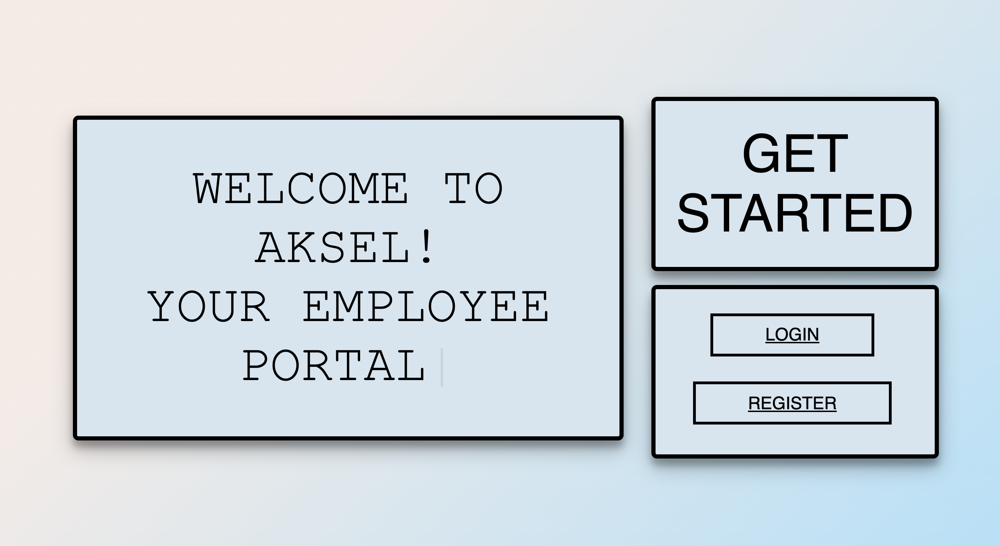
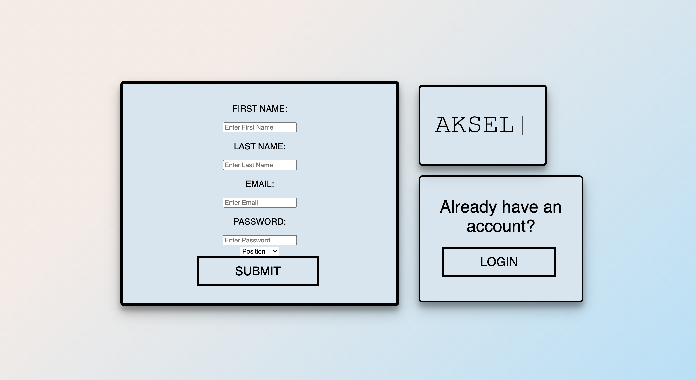
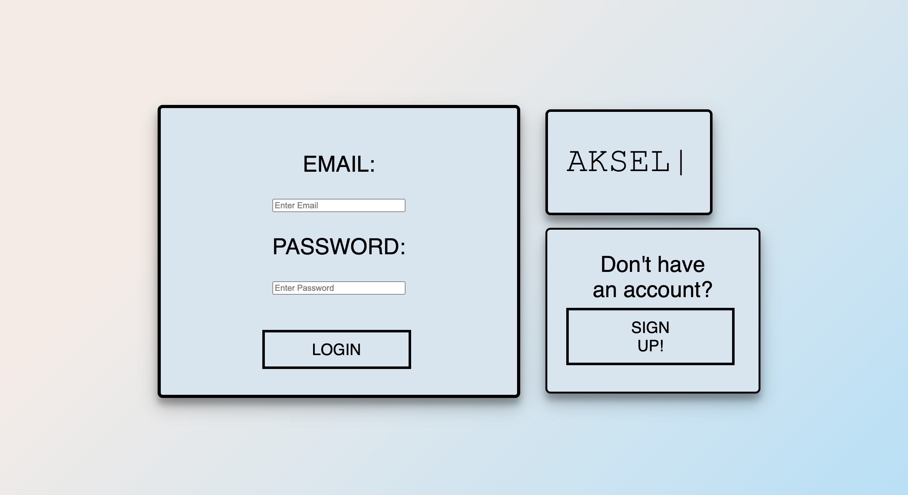
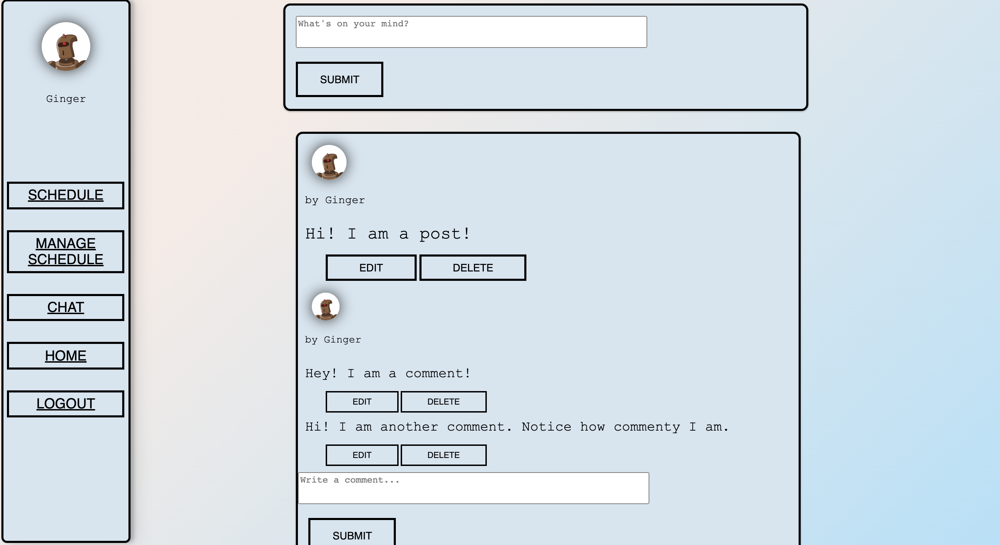
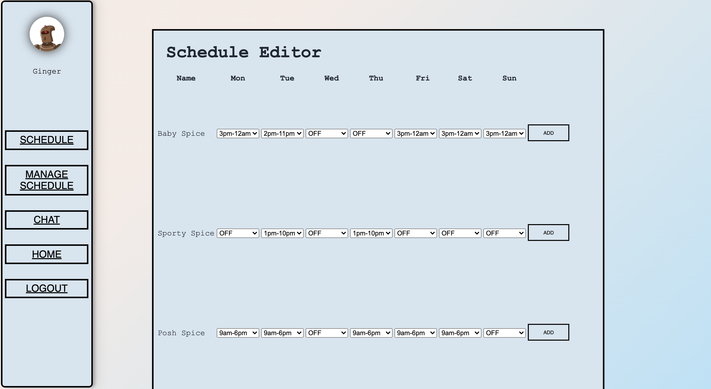
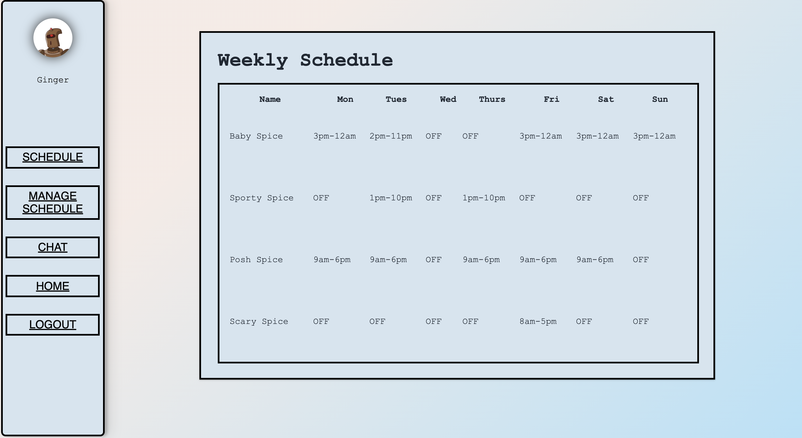
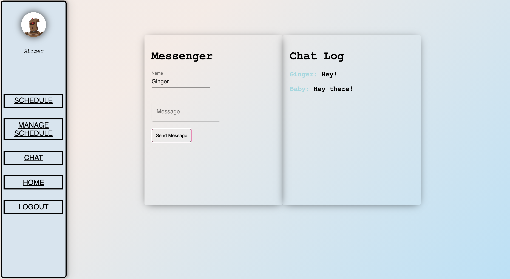

# Welcome to Aksel!

### Live production site available [here](www.akselpro.dev)!

### Aksel is a way for restaurant workers to communicate all in one place.

###  

#### The Stack
* React
* JavaScript
* SASS
* Node.Js
* Redux
* Postman
* Heroku
* Socket.io

###  

#### *Aksel users will have access to the dashboard where announcements will be posted as well as having the option to comment on those posts. Users will also be able to see their weekly schedule & managers have the ability to edit the schedule. Aksel also comes with a live chat so getting in touch with coworkers is easier than ever!*

###  

### I have already created a manager account so you don't have to, so you can check out Aksel's features in action!

### Email: manager@gmail.com
### Password: pass1

#### *Logging in as a manager gives you access of managing the employees schedule.*

###  

### Aksel was created as my personal project while completing an immersive remote bootcamp at Devmountain.

###  

### I come from a restaurant management background & Aksel was created with that in mind!

###  

